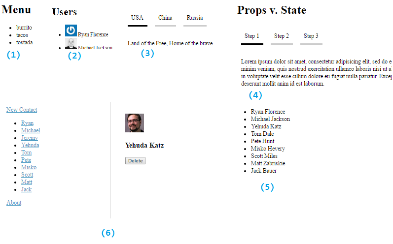

This is an intro to React by Ryan Florence from FrontEnd Masters. 

##Screenshot of Exercises


##1.Your First Component

```
require('./tests');
var React = require('react');
var sortBy = require('sort-by');

var DATA = {
  title: 'Menu',
  items: [
    { id: 1, name: 'tacos', type: 'mexican' },
    { id: 2, name: 'burrito', type: 'mexican' },
    { id: 3, name: 'tostada', type: 'mexican' },
    { id: 4, name: 'hush puppies', type: 'southern' }
  ]
};

var Menu = React.createClass({
  render () {
    
    var items = DATA.items.filter((item) => {
      return item.type === 'mexican';
    })
    .sort(sortBy('name'))
    .map((item) => {
      return <li key={item.id}>{item.name}</li>;
    });

    return (
      <div>
        <h1>{DATA.title}</h1>
        <ul>{items}</ul>
      </div>
    );
  }
});

React.render(<Menu/>, document.body, () => {
  require('./tests').run();
});
```

##2.Props

PropTypes

```
propTypes look like this:

  propTypes: {
    user: React.PropTypes.shape({
      email: React.PropTypes.string.isRequired,
      name: React.PropTypes.string.isRequired,
      id: React.PropTypes.number.isRequired
    }).isRequired
  },
and are useful for error checking
```


Props are a lot like element attributes

```
var App = React.createClass({
  render () {
    var users = USERS.map((user) => {
      var size = 36;
      var hash = md5(user.email);
      var url = `${GRAVATAR_URL}/${hash}?s=${size*2}`;
      return (
        <li>
           {user.name}
        </li>
      );
    });
    return (
      <div>
        <h1>Users</h1>
        <ul>{users}</ul>
      </div>
    );
  }
});
```

We can create our own propTypes
```
var emailType = (props, propName, componentName) => {
  warning(
    validateEmail(props.email),
    `Invalid email '${props.email}' sent to 'Gravatar'. Check the render method of '${componentName}'.`
  );
};
```

##3.Events and States

* these states are found in the component i.e. React.createClass({})
* set your initial state using 'getInitialState'
* change the state using onClick={/*function*/} and this.setState({})
* can also listen for changes in <input> or <textarea> using onChange prop

```
var App = React.createClass({

  //setting default states
  getInitialState: function() {
    return {
      activeTabIndex: 0,
    }
  },

  //changing states
  toggle: function(activeTabIndex){
    //**ES6 allows you to set the activeTabIndex to the parameter if they're of the same name
    this.setState({ activeTabIndex});
  },

    renderTabs () {
    //**on props: referencing the props added to the App component
    return this.props.countries.map((country, index) => {
      return (
        //getting values of state using this.state.stateName
        <div onClick={this.toggle.bind(this, index)} style={index === this.state.activeTabIndex ? styles.activeTab : styles.tab}>
          {country.name}
        </div>
      );
    });
  },

//**on props: countries is added as a prop
React.render(<App countries={DATA}/>, document.body);
```

##4.Props vs State


* state: for changes thats only related to itself/ children
* prop: for properties that dont change
* store: for changes that need to be persistent and accessed via others

in this video, he was trying to set a button 'toggleall' that will toggle both of the divs.
however, he was having trouble because the child was handling its own state, and the button was trying to handle the same state. it would require two way binding

to move the state up / add a property that tells the div what data to show
switch out this.state to this.props and then pass the state as a prop through the parent component

React Life Cycle
*componentDidUpdate () { //function to fire off when prop is done updating}

For more info, see [the actual code](/exercises/4-props-v-state/app.js)

##5.Flux


* sets the action handling to the side
* dispatcher sends message to every store
* VIEWS --> USER INTERACTION --> ACTION CREATORS --> WEB API UTILS --> WEB API --> BACK TO ACTION CREATORS 
--> ACTIONS --> DISPATCHER --> CALLBACKS --> STORES --> CHANGE EVENTS/ STORE QUERIES --> VIEWS
* goes from the views to the actions to the dispatcher to the stores and then back to the views

For more info, see [my notes](/exercises/5-flux/notes.js)

##6.Routing

For more info, see [my notes](/exercises/6-routing/notes.js)

##7. Migrating to React

Did not do this exercise. See the app.js 